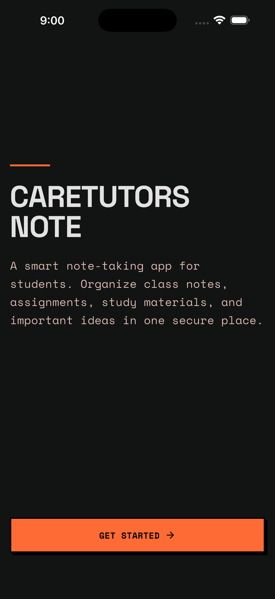
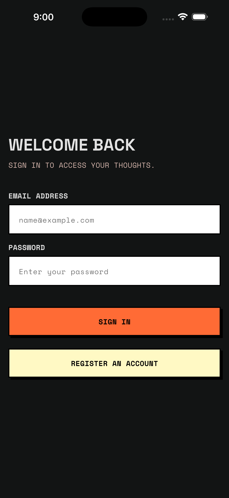
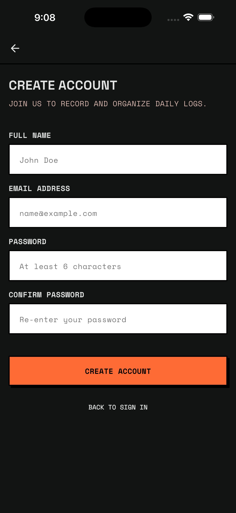
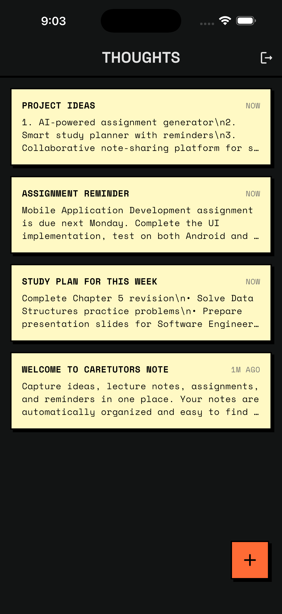
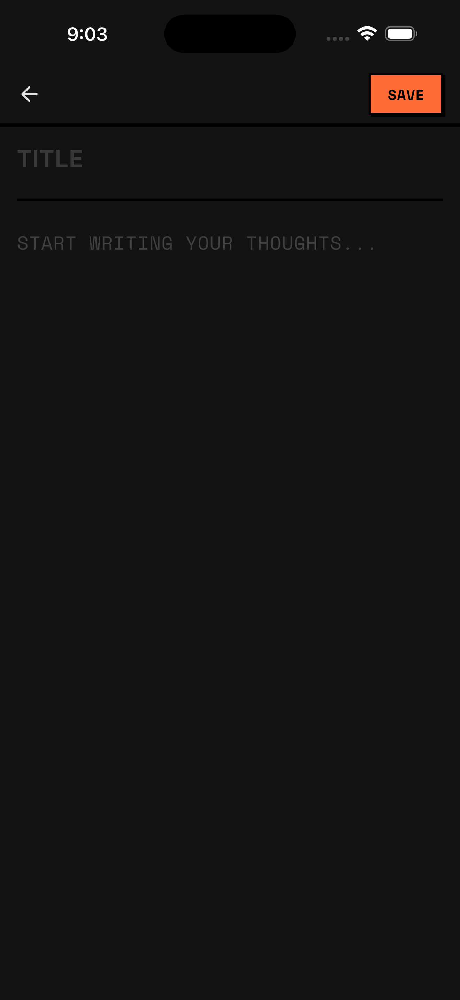

# CareTutors Note: The Nocturnal Archive

A premium, secure note-taking application developed as a recruitment task from CareTutors. The application features a high-contrast dark theme customized around writing efficiency, built with a clean architecture, GetX state management, and GoRouter protective navigation.

---

## 🎨 Design Philosophy: Nocturnal Archive

The visual layout is built on a **Neo-Brutalist** foundation, tailored for dark mode:

* **Hard Outlines**: Surfaces and interactive objects are defined by flat fills and heavy **2px solid black borders**, rejecting gradients and traditional shadows.
* **Sharp Corners**: Strictly **0px border radius** on all cards, buttons, input fields, and dialogs.
* **Tactile Depth**: Elements use solid black offset shadows (`4px 4px 0px #000000`) for a paper-cut look. Interactive elements "sink" when tapped, translating their position down-right and removing the shadow offset.
* **Color System**: Anchored by Deep Charcoal (`#121414`) background, Vibrant Orange (`#FF6B35`) accent actions, and Pale Cream (`#FFF9C4`) content card canvases.
* **Typography**: Paired display headlines in **Space Grotesk** with functional monospaced copy in **Space Mono**.

---

## ✨ Features

* **One-Time Onboarding**: Introduces the app's scope to users. Handled via local `shared_preferences` persistence to display only on the very first launch.
* **Secure Authentication**: Register and login using Firebase Auth. Forms include active validation and password confirmation.
* **Real-Time Synchronisation**: Notes are stored in Cloud Firestore and linked to the authenticated user's account. Supports editing existing notes and swipe-to-delete.
* **Tactile Buttons**: Buttons are constructed using custom gesture controls to simulate physical button presses.
* **Index-Free Queries**: Fetches notes and orders them chronologically in-memory, avoiding the need for composite indexes in the Firebase Console.

---

## 📱 Showcase

| Onboarding | Login Gateway | Registration Portal | Notes Library | Editor Canvas |
| :-: | :-: | :-: | :-: | :-: |
|  |  |  |  |  |
| First-launch portal | Login| Register | Home | Editor |

---

## 🛠️ Technical Stack

* **State Management**: [GetX](https://pub.dev/packages/get) for reactive variables and dependency injection.
* **Navigation & Guards**: [Go_Router](https://pub.dev/packages/go_router) for secure paths and redirects.
* **Database & Auth**: [Firebase](https://firebase.google.com/) (Firebase Auth & Cloud Firestore).
* **Local Storage**: `shared_preferences` for onboarding state.
* **Typography**: Google Fonts (`Space Grotesk` & `Space Mono`).

---

## 🏗️ Project Structure

The project is structured according to **Clean Architecture** principles to separate business logic from implementation details:

```text
lib/
├── core/
│   ├── constants/             # Design Tokens (AppColors, AppTypography, AppSpacing)
│   ├── di/                    # Dependency injection (Global repositories and controllers setup)
│   ├── routes/                # GoRouter path definitions & protective redirects
│   └── theme/                 # ThemeData lightTheme mapping (borders & fonts)
├── features/
│   ├── onboarding/            # Onboarding view and controller
│   ├── auth/                  # Credentials Portal
│   │   ├── domain/            # AuthRepository contract
│   │   ├── data/              # FirebaseAuthRepository implementation
│   │   └── presentation/      # Form Views and AuthController
│   └── notes/                 # Notes Library & Canvas
│       ├── domain/            # NoteModel & NotesRepository contract
│       ├── data/              # FirestoreNotesRepository implementation
│       └── presentation/      # Listing & writing Views, controllers, and custom widgets
└── main.dart                  # Initializer for Firebase, GetX container, and GetMaterialApp
```

---

## 🚀 Setup & Installation

### 📋 Prerequisites
* Install the [Flutter SDK](https://docs.flutter.dev/get-started/install) (version >= 3.12.0).
* Set up a working emulator or connect a physical target debugging device.

### 🔧 Step-by-Step Installation

1. **Clone the Repository**
   ```bash
   git clone https://github.com/akibur-rohman/CareTutors-Note-App.git
   cd CareTutors-Note-App
   ```

2. **Fetch Dependencies**
   ```bash
   flutter pub get
   ```

3. **Configure Database Permissions**
   Ensure your Firebase native configuration files (`google-services.json` for Android / `GoogleService-Info.plist` for iOS) are placed in their respective folders. Make sure your **Firestore Database rules** are set as follows on the Firebase Console:
   ```rules
   rules_version = '2';
   service cloud.firestore {
     match /databases/{database}/documents {
       match /notes/{noteId} {
         allow read, update, delete: if request.auth != null && request.auth.uid == resource.data.userId;
         allow create: if request.auth != null && request.auth.uid == request.resource.data.userId;
       }
     }
   }
   ```

4. **Boot the Application**
   ```bash
   flutter run
   ```


